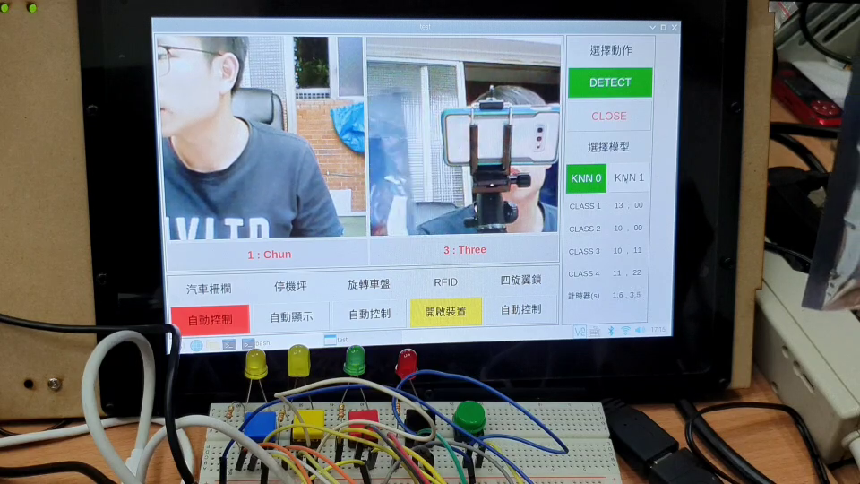

# Modify Source Project
Item | Description
-----|-----
Date |109/12/10
Author| 張嘉鈞 Chia-Chun, Chang

---



# 套件需求
```
1. Opencv
2. Tkinter
3. Pillow
4. argparse
```

# 程式碼

## 1. ~~coral_with_data.py~~

* 將其修改成能夠儲存照片(原本的版本是無法儲存拍的照片)
* 啟動的時候自動讀取
* 按下按鈕0即可清除buffer以及data資料夾

## 2. coral_cv_with_data.py

* 將原本的PyGi串流方式改為OpenCV
* 提供一個Thread來執行Infer的部分
* 修改最終取得的數值：原本回傳 info ( FPS,NUMS,CLASSES字串），現在回傳 info, cls (單傳CLASSS)
* 可以選定儲存位置
```bash
$ python coral_cv_with_data.py -d 'data1'
```

## 3. test.py

GUI版本：將 coral_cv_with_data.py 結合 tkinter
與 coral_cv 不同的地方在於 Thread 改變成專門進行 TM 分類，若不將其放入Thread則FPS會掉到1~5之間。
```bash
$ python test.py -d1 'data1' -2 'data2' -c 2
```

## 4. test_v2.py

* 修正BUG
* 提供較實際的範例程式，
* 新增 timer 計時器
* 優化介面
* 可修改顯示類別
* 新增執行檔，點擊 .sh 檔案即可開啟
```
$ ./final_1091209v2.sh
```

---
# test_v2.py 片段介紹：

## 1. Image_Process: 影像處理相關
```
class Image_Process():

    def crop(self, image):
        h, w, _ = image.shape
        cut = int((w-h)/2)
        return image[0:h, cut: int(w-cut)]
    def resize(self, image, resize=(224)):
        return cv2.resize(image, (resize,resize) )
    def cv2pil(self, image):
        f_rgb= cv2.cvtColor(image, cv2.COLOR_BGR2RGB)
        return Image.fromarray(f_rgb)
    def pil2tk(self, image):
        return ImageTk.PhotoImage(image)
```
## 2. Log: 顯示格式以及計算運行時間
```
class Log():

    def log_t(self, content, t=None, end='\n\n'):
        if t==None:
            print(f'\n{content}', end=end)
            return time.time()
        else:
            t_cost = time.time()-t
            print('{} ({:.5f}s)'.format(content, t_cost))
            return t_cost
```
## 3. MyVideoCapture: OpenCV 取得影像串流方法
```
class MyVideoCapture(Image_Process, Log):
    
    def __init__(self, video_source):
    
        #將原本Webcam影像畫面大小設定為320X240
        self.vid = cv2.VideoCapture(video_source)
        self.vid.set(cv2.CAP_PROP_FRAME_WIDTH,320)
        self.vid.set(cv2.CAP_PROP_FRAME_HEIGHT,240)
        
        if not self.vid.isOpened():
            raise ValueError("Unable to open video source", video_source)

    def get_frame(self):
        if self.vid.isOpened():
            ret, frame = self.vid.read()
            if ret:
                frame = self.resize( self.crop(frame))
                return (ret, frame)
            else:
                return (ret, None)
        else:
            return (ret, None)
```
## 4. App_Setup: 設定GUI介面以及基本的按鈕事件
```
class App_Setup():

    def __init__(self, win_title, mode=2):

        super().__init__()
        
    ...

```
## 5. App: 主要運行的階段
```
class App(App_Setup, Image_Process, Log):

    def __init__(self, win_title, knn, data_path, dev_0 = 0, dev_1 = 2, mode=2):
        
        t_init = self.log_t('Initialize', end=' ... ')

        super().__init__(win_title, mode)    

        ...

        self.cap_0 = MyVideoCapture(dev_0)
        self.cap_1 = MyVideoCapture(dev_1)
        threading.Thread(target=self.tm, daemon=True, args=()).start()
    
        self.update()
        self.window.mainloop()
```
## 6. 修改類別 (line 339): 修改 `ur_cls_0` 或 `ur_cls_1`，如果只有2個類別其他請填上 `'--'`
```
self.classes = ['--', 'One', 'Two', 'Three', 'Four']
self.ur_cls_0 = ['--', 'Chun', 'Other', 'Water', 'Wallet']
self.ur_cls_1 = ['--', 'One', 'Two', 'Three', 'Four']
```
## 7. 提供兩個範例: 辨識範例(line 447) `knn_example`、計時器範例(line 414) `timer_event`，透過 detect 按紐開啟

```
def update(self):
        
        # 取得相機畫面
        self.knn_event()

        # 如果按下 Detect 則會顯示辨識結果
        self.show_info( self.isDetect )

        # 透過辨識結果而啟動的副函式
        self.knn_example()

        # 計時器
        self.timer_event()

        # 當按下 aporn 的時候 WS2812 的 Thread 會執行
        self.ws2812_event()

        # 執行完之後延遲幾毫秒再執行
        self.window.after(self.delay, self.update)
```
